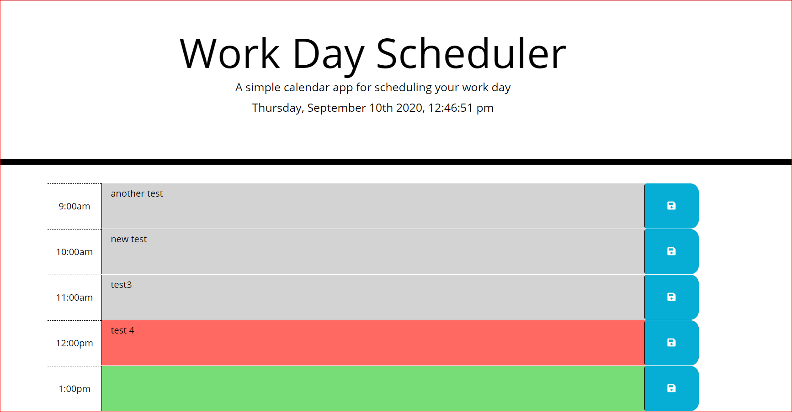

# workschedule
1. web app offers a basic employee scheduling functionality.
2. the hourly scheduled details are stored localy and retrived.
3. a color code is applied to view the past , present and future hours instantly.
4. stored value can be overwritten if necessary do so.

# screenshot
Starting page 
# published address
 this site is published at https://sundakathir.github.io/workschedule/
 